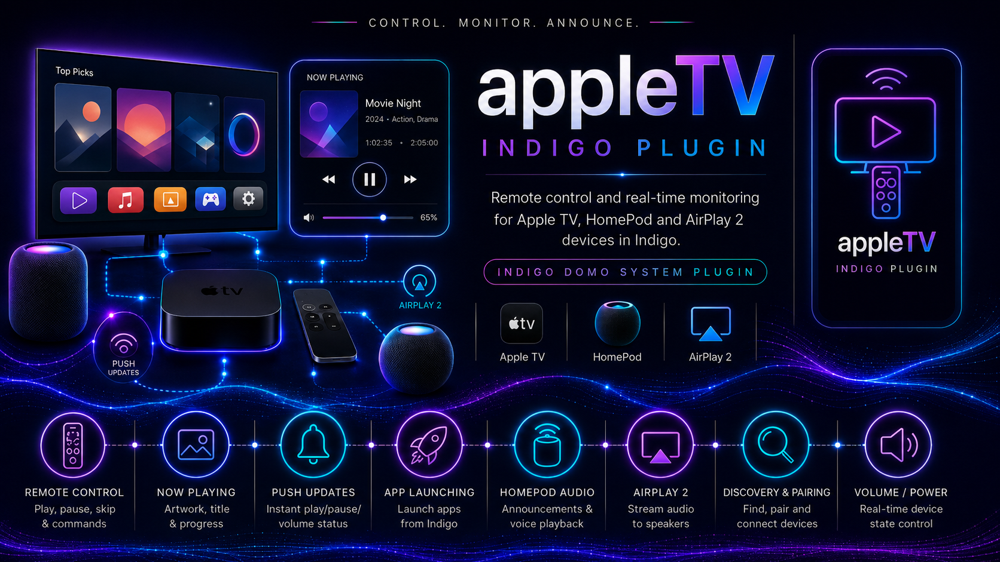

# Changelog

Full release history is also available on [GitHub Releases](https://github.com/Ghawken/appleTV-indigoPlugin/releases). Entries are newest first.

---

## 1.8.0 — 2026-02-14

- Update pyatv to 0.17 — includes updates to the device volume endpoint control API
- Update all bundled libraries and dependencies
- Bug fixes for breaking changes in the updated library APIs
- Support for new Python 3 versions and updated Indigo releases

---

## 1.7.10 — 2025-08-30

- Switch to the official pyatv release build (previous versions used an unmerged pull request)
- Update bundled libraries and dependencies

---

## 1.7.01 — 2025-04-20

- Programmatically calculate playback position between push events; update `currentlyPlaying_Position` and related states every 10 seconds during active playback
- Consolidate default artwork thumbnails to two user-replaceable files: `apple-tv-default-thumb.png` and `apple-tv-default-thumb-paused-overlay.png` (in `~/Pictures/Indigo-appleTV/`)
- Re-style Edit Device Settings — hide the artwork section until pairing is complete
- Suppress async disconnect timeout exceptions for already-closed connections
- Remove artwork-related log noise for devices that do not support artwork (HomePods, AirPlay 2 speakers)

---

## 1.6.14

- Add progress bar artwork saving — automatic on state change, and as an explicit action
- Progress bar width and fill colour configurable
- Fix async timeout issues on disconnections
- Add **Modify Artwork** options: None, Size (aspect ratio fix), Grayscale (on pause), Overlay (on pause)
- Add **Overlay File Information on Artwork** option: renders track title and estimated finish time onto the artwork image

---

## 1.6.11

- Set Indigo device error state when connection is lost or cannot be established

---

## 1.6.6

- Filter non-printable emoji characters from track titles
- Fix `(null):` prefix in titles from some apps (e.g. Plex DVR)
- Add device states: `currentlyPlaying_finishTime`, `currentlyPlaying_remainingTime`, `currentlyPlaying_percentComplete`
- Use empty strings for unreported states (instead of `None` or `"Not Available"`)

---

## 1.6.5

- Compatibility updates for tvOS 18.4 Companion protocol changes
- Add Simple Commands: `TOP_MENU`, `APP_SWITCHER`, `SCREENSAVER`, `SKIP_FORWARD`, `SKIP_BACKWARD`, `SWIPE_LEFT/RIGHT/UP/DOWN`
- Bug fix: auto-dismiss the screensaver before sending playback commands

---

## 1.6.0

- Add **Artwork Modify** option (size, grayscale on pause, overlay on pause)
- Resize artwork to a square canvas maintaining aspect ratio — suited for Refreshing URL Control Pages
- Auto-save artwork on power state and play state changes (opt-in per device)
- Move default thumbnail to `~/Pictures/Indigo-appleTV/` for user customisation
- Update pyatv library for tvOS 18.4 Companion compatibility

---

## 1.5.14

- Auto-save artwork on power state and play state changes
- Customisable default play / pause / idle thumbnail images

---

## 1.5.10

- Animated default artwork thumbnail for kiosk / web viewer use
- Clear now-playing states on device power off

---

## 1.5.8

- Add default artwork thumbnail shown when nothing is playing

---

## 1.5.7 — 2025-03-09

- **Significant improvement:** live power state updates are now immediate and accurate
- Add device states: `currentlyPlaying_EpisodeNumber`, `currentlyPlaying_SeasonNumber`, `currentlyPlaying_SeriesName`, `currentlyPlaying_Identifier`, `currentlyPlaying_ArtworkID`
- Add TouchGesture support (swipe actions via Companion protocol)
- Add keyboard / text input support

---

## 1.4.7 — 2024-09-17

- Handle tvOS 18 MAC address re-creation — devices can now be re-identified by IP when the stored MAC changes
- Add **Force Connection to this IP** button in device edit screen
- Add menu item: **Scan for Devices and Log results**
- Add menu item: **Scan single IP Address**
- Add action: **Manually Update IP Address**
- Pin all pyatv dependency versions to prevent future incompatible upgrades

---

## 1.2.26 — 2024-01-25

- Fix a packaging / cryptography library version conflict

---

## 1.2.25 — 2024-01-25

- Update pyatv to 0.14.5
- Use pyatv `FileStorage` for credential persistence
- Fix connection timeout bugs reported after 1.2.20

---

## 1.2.20 — 2024-01-17

- Move all Python dependencies into `requirements.txt` — no manual `pip install` required
- Use `homekitlink_ffmpeg` PyPI package for automatic ffmpeg installation
- Add **Rerun Ffmpeg Call for logging** menu item for TTS diagnostics
- Increase Start Connection timeout to 90 seconds
- Update pyatv to 0.13.4

---

## 1.2.0 — 2023-08-06

- **Minimum Indigo API raised to 3.4 (Indigo 2023.2+)**
- Fix `play_url` command for tvOS 16.4+ (HTTPS/MP4/M3U8 streams work)
- Add AirPlay 2 speaker support — stream audio to any AirPlay 2 device including Sonos
- Add `Volume` device state with live listener
- Add `CompanionPort` device state; remove `MRPPort` state
- Add screensaver activation command support
- Add keyboard / text input API
- Improved audio buffering

---

## 1.0.1 — 2023-03-26

- First stable release
- Apple TV remote control via Indigo actions
- HomePod text-to-speech announcements
- Push-update device states: play/pause/power/now-playing metadata

---

## 0.1.10 — 2022-12-10

- Add **Speak Announcement** action — TTS to HomePods with Indigo variable and device state substitution
- Convert text to MP3 via macOS `say` + ffmpeg for HomePod AirPlay playback

---

## 0.0.26 — 2022-12-01

- Switch default connection mode to unicast (IP-based); fall back to multicast after 3 failures
- Add unicast single-IP scan option in Plugin Config

---

## 0.0.21 — 2022-11-28

- Significantly improved disconnect / reconnect handling
- Add pyatv verbose debug logging (file only, opt-in)

---

## 0.0.15 — 2022-11-27

- Dynamically expose all pyatv remote commands — future library additions appear automatically
- Add optional argument support: double tap, hold, set volume, play URL, seek position

---

## 0.0.12 — 2022-11-26

- Initial release

---

← [FAQ](FAQ) → [Support](Support)
