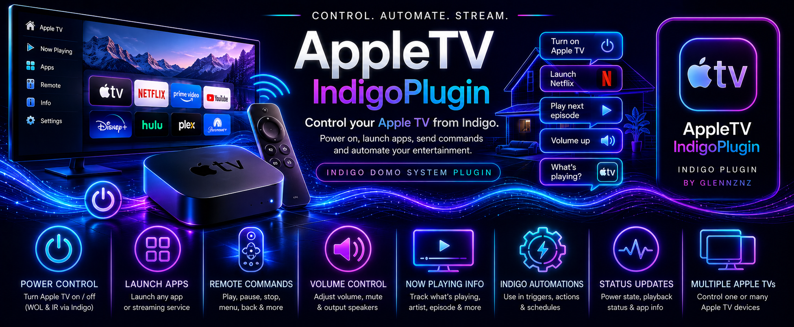

# Devices

The plugin exposes a single device type: **AppleTV Device** (Indigo relay). It represents an Apple TV, HomePod, or AirPlay 2 speaker. Devices are created automatically via Plugin Config → **Generate AppleTV Devices**.

## Device config fields


### Connection & pairing

| Field | Purpose |
|---|---|
| **Start Connection** | Initiates the pairing / connection process. Watch the Indigo Event Log for instructions |
| **Force Connection to this IP** | Re-pairs using the device's current IP address, overriding a stale stored identifier. Use this after tvOS 18+ updates that reassign device MAC addresses |
| PinCode | Enter the 4-digit code displayed on the Apple TV screen during pairing |
| **Submit PinCode** | Sends the entered PIN to complete AirPlay pairing |

The pairing section is always visible. The artwork section below is hidden until pairing is complete.

### Artwork settings

These fields appear after the device has been successfully paired.

| Field | Type | Default | Description |
|---|---|---|---|
| Auto Save Artwork | Checkbox | Off | Automatically saves artwork to `~/Pictures/Indigo-appleTV/<DeviceName>_Artwork.png` whenever play state or power state changes |
| Default Width for Artwork/Bar | Text | `512` | Output width in pixels. Height is auto-calculated to maintain aspect ratio. Applied to both artwork and progress bar images |
| Modify Artwork | Menu | No modification | How artwork is processed before saving — see table below |
| Overlay File Information on Artwork | Checkbox | Off | Renders the track title (bottom-left) and finish time (bottom-right) directly onto the saved artwork image |
| Automatically Update Progress Bar | Checkbox | Off | Auto-saves a progress bar PNG alongside artwork whenever playback state changes and every 10 seconds during active playback |
| Progress Bar Colour | Menu | White | Fill colour for the completed portion of the progress bar |

### Artwork modification modes

| Mode | Behaviour |
|---|---|
| No modification | Saves raw artwork bytes unchanged |
| Aspect ratio fix only | Fits the artwork inside a square canvas of the configured width, preserving aspect ratio, on a transparent background |
| On pause grayscale artwork | Square-fits always; converts to greyscale when the device is paused, colour when playing |
| On pause overlay paused image | Square-fits always; composites the pause overlay image onto the artwork when paused |

**Custom overlay image:** The pause overlay is `~/Pictures/Indigo-appleTV/apple-tv-default-thumb-paused-overlay.png`. Replace this file with your own (same filename, PNG with transparency) to customise the pause indicator. Delete it and restart the plugin to restore the default.

**Default thumbnail:** When no artwork is available (device idle or app doesn't expose artwork), the plugin uses `~/Pictures/Indigo-appleTV/apple-tv-default-thumb.png`. Replace it to customise; delete and restart to restore the default.

### Read-only device properties

Populated automatically; cannot be edited directly.

| Field | Description |
|---|---|
| Name | Device name as reported by the Apple TV / HomePod |
| IP number | Current IP address |
| MAC number | Unique device identifier used for reconnection |
| Model/SW | Hardware model string |
| Identifier | pyatv unique identifier |
| Pairing Credentials | Stored AirPlay credential string (opaque) |

## Device states


### Infrastructure states

| State ID | Type | Description |
|---|---|---|
| `status` | String | Human-readable connection status, e.g. `Paired. Push Updating.` or `Connection Failed. Retrying…` |
| `ip` | String | Current IP address |
| `MAC` | String | MAC address / unique identifier |
| `identifier` | String | pyatv device identifier |
| `name` | String | Device name |
| `model` | String | Hardware model |
| `manufacturer` | String | Manufacturer (typically `Apple`) |
| `deepSleep` | Boolean | Whether the device is in deep sleep |
| `PowerState` | String | `On`, `Off`, or `Idle` |
| `Volume` | Float | Current volume level (0–100) |
| `CompanionPort` | String | Companion protocol port number |
| `AIRPLAYPort` | String | AirPlay protocol port number |
| `RAOPPort` | String | RAOP protocol port number |

### Now-playing states

| State ID | Type | Description |
|---|---|---|
| `currentlyPlaying_PlayState` | String | `Playing`, `Paused`, `Idle`, `Seeking`, `Stopped`, or `Standby` |
| `currentlyPlaying_DeviceState` | String | Raw pyatv device state value |
| `currentlyPlaying_MediaType` | String | `Music`, `TV`, `Video`, `Unknown`, etc. |
| `currentlyPlaying_Title` | String | Track or episode title |
| `currentlyPlaying_Artist` | String | Artist name |
| `currentlyPlaying_Album` | String | Album name |
| `currentlyPlaying_Genre` | String | Genre |
| `currentlyPlaying_App` | String | Name of the currently running app |
| `currentlyPlaying_AppId` | String | Bundle identifier of the running app |
| `currentlyPlaying_Position` | String | Playback position in seconds |
| `currentlyPlaying_TotalTime` | String | Total duration in seconds |
| `currentlyPlaying_finishTime` | String | Estimated finish time (e.g. `3:45 PM`) |
| `currentlyPlaying_remainingTime` | String | Remaining time (e.g. `1 hr 32 min`) |
| `currentlyPlaying_percentComplete` | String | Completion percentage (e.g. `32.1%`) |
| `currentlyPlaying_ArtworkID` | String | Unique ID of the current artwork; changes each time the artwork changes |
| `currentlyPlaying_Repeat` | String | Repeat state |
| `currentlyPlaying_Shuffle` | String | Shuffle state |
| `currentlyPlaying_Identifier` | String | Content identifier |
| `currentlyPlaying_SeriesName` | String | TV series name |
| `currentlyPlaying_SeasonNumber` | String | Season number |
| `currentlyPlaying_EpisodeNumber` | String | Episode number |

> **Position updates:** `currentlyPlaying_Position`, `_finishTime`, `_remainingTime`, and `_percentComplete` are updated on each push event from the device, and also synthetically every 10 seconds while playback is active. They are cleared when the device powers off.

> **Indigo relay behaviour:** The **Turn On / Turn Off / Toggle** buttons in the Indigo device row send power-on / power-off commands to the Apple TV. The `PowerState` state is more reliable than `onOffState` for trigger conditions — use it in preference.

## Example trigger conditions

| Goal | Trigger condition |
|---|---|
| Dim lights on playback | `currentlyPlaying_PlayState` changes to `Playing` |
| Restore lights on pause | `currentlyPlaying_PlayState` changes to `Paused` |
| Turn off lights when idle | `currentlyPlaying_PlayState` changes to `Idle` |
| React to a specific app | `currentlyPlaying_App` changes to `Netflix` |
| React to a TV episode | `currentlyPlaying_SeriesName` is not blank |

## Using artwork and progress bar in Control Pages

1. In the device config, tick **Auto Save Artwork** (and optionally **Automatically Update Progress Bar**)
2. In your Indigo Control Page, add a **Refreshing URL** image block
3. Point it at the file on disk:
   ```
   file:///Users/<username>/Pictures/Indigo-appleTV/<DeviceName>_Artwork.png
   file:///Users/<username>/Pictures/Indigo-appleTV/<DeviceName>_progressBar.png
   ```
4. Set a refresh interval of 10–15 seconds

The progress bar is a transparent PNG, suitable for overlaying on artwork.


---

← [Configuration](Configuration) → [Actions](Actions)
